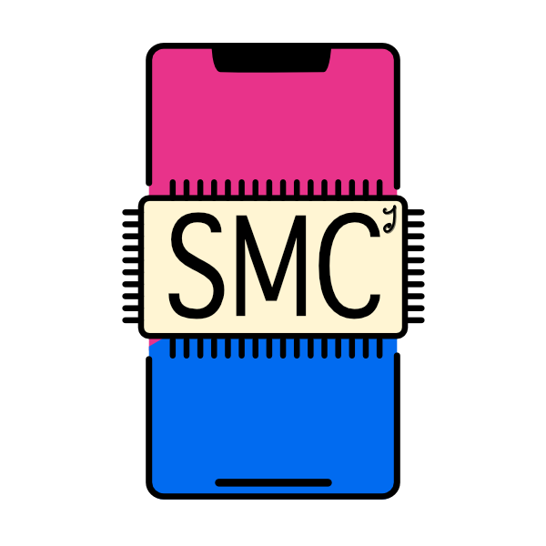

# Simple Memory Cache (Java)

This is an in-memory cache that you can drop into any java application.



It creates a fixed-size LRU in-memory cache so you can control the amount of memory in use. You can also supply a TTL (time-to-live) for each object and the cache will remove objects that have not been accessed for that period in it GC cycle.

## Usage

```java
static final int CACHE_SIZE = 7500;
static final int TTL = 2 * 24 * 60 * 1000; // 2 days
SimpleMemoryCache<String, Response> cache = new SimpleMemoryCache(CACHE_SIZE, TTL);
...
Response resp = cache.get(ip);
if(resp == null) {
	resp = goAndGet(ip);
	cache.put(ip, resp);
}
```

Simple.

-----

